# 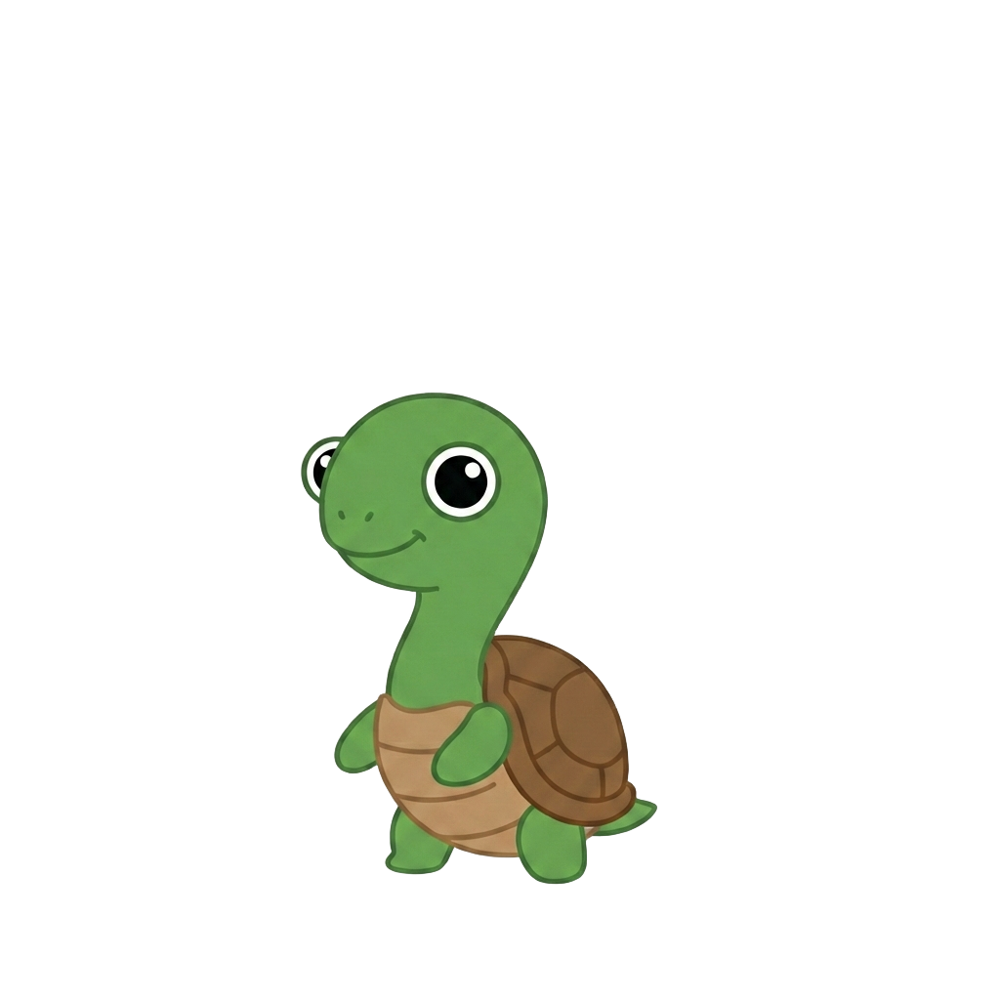 Kkobuk

거북목을 실시간으로 감지하고 교정을 도와주는 데스크탑 애플리케이션입니다.
웹캠으로 사용자의 자세를 분석해 거북목이 감지되면 즉시 알림을 보냅니다.

## 다운로드

| 플랫폼 | 다운로드 |
|--------|---------|
| Windows | [kkobuk-1.0.5-setup.exe](https://github.com/ehgk4245/Kkobuk/releases/download/v1.0.5/kkobuk-1.0.5-setup.exe) |
| macOS | [kkobuk-1.0.5.dmg](https://github.com/ehgk4245/Kkobuk/releases/download/v1.0.5/kkobuk-1.0.5.dmg) |

> 전체 릴리즈 목록: [Releases](https://github.com/ehgk4245/Kkobuk/releases)

### macOS 첫 실행 시
macOS 보안 정책으로 인해 "개발자를 확인할 수 없습니다" 경고가 표시될 수 있습니다.
앱 아이콘을 우클릭 → **열기**를 선택하면 실행됩니다.

---

## 프로젝트 설명

## 목차

- [아키텍처](#아키텍처)
- [프로젝트 구조](#프로젝트-구조)
- [주요 기능](#주요-기능)
- [모델 학습 및 추론](#모델-학습-및-추론)
  - [데이터 추출 및 전처리](#데이터-추출-및-전처리)
  - [모델 선택 및 이유](#모델-선택-및-이유)
  - [학습 파이프라인](#학습-파이프라인)
  - [추론 파이프라인](#추론-파이프라인)
- [기술 스택](#기술-스택)

---

## 아키텍처

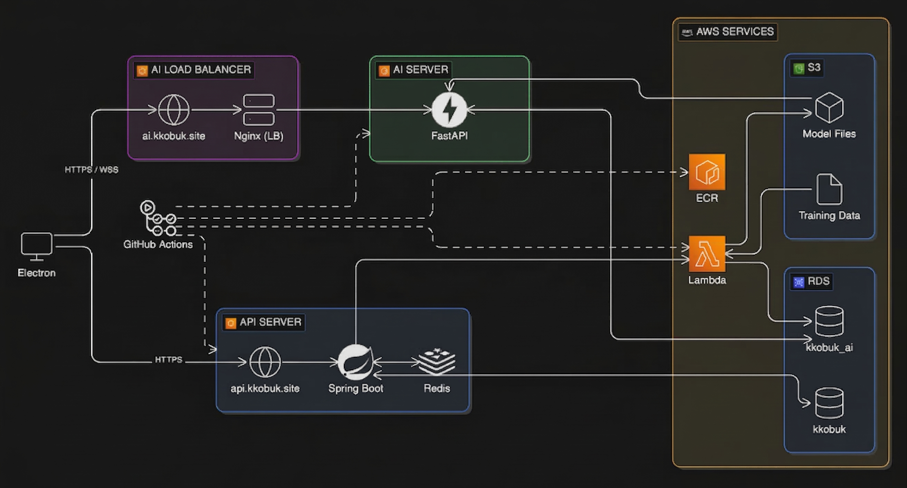

- **Spring Boot** — 사용자 인증(OAuth2/JWT), 자세 세션 기록, 주간 통계 등 핵심 비즈니스 로직 담당
- **FastAPI** — 사용자별 개인화 모델을 S3에서 로드·캐싱하고, 클라이언트와 WebSocket으로 연결해 실시간 AI 추론 처리
- **EC2 LB** — FastAPI 서버 앞단에 Nginx 로드밸런서 전용 EC2를 별도 배치, EC2 추가만으로 AI 추론 서버를 수평 확장 가능한 구조
- **Lambda** — CPU 집약적인 LR 모델 학습을 요청 시에만 실행되는 서버리스 함수로 분리해 API 서버 부하 없이 처리

---

## 프로젝트 구조

```
.github/
├── workflows/       # GitHub Actions CI/CD 워크플로우
└── scripts/         # 배포 스크립트
client/              # Electron + React 데스크탑 앱
server/              # Spring Boot REST API (api.kkobuk.site)
ai/
├── fastapi/         # FastAPI AI 추론 서버 (ai.kkobuk.site)
├── lambda/          # AWS Lambda 학습 파이프라인
└── shared/          # 전처리 공통 모듈
infra/
├── terraform/       # AWS 인프라 IaC
└── local/           # 로컬 개발용 Docker Compose (MySQL + Redis)
```

---

## 주요 기능

<details>
<summary><b>학습</b> — 나만의 자세 모델 생성</summary>

웹캠으로 자세 데이터를 수집해 개인화된 거북목 감지 모델을 학습합니다.

| 안내 | 학습 전 | 완료 |
|------|---------|------|
| 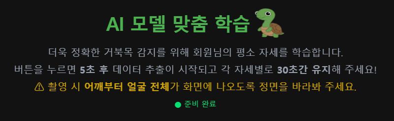 | 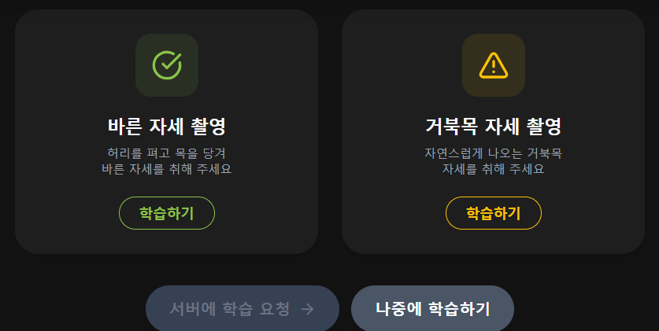 | 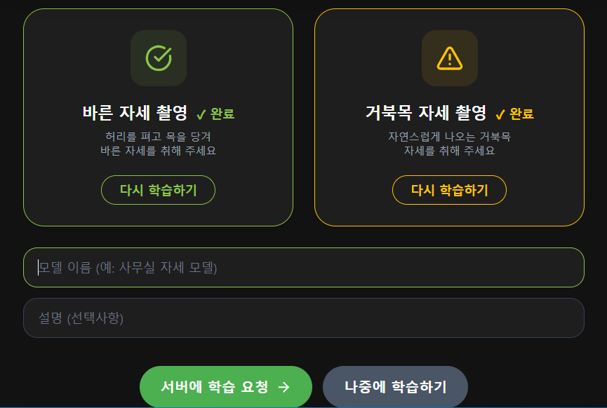 |

- **나중에 학습하기** 버튼으로 학습 페이지를 건너뛰고 메인 화면으로 바로 이동 가능
- 각 자세별 **학습하기** 버튼을 누르면 30초간 자세를 측정
- 모든 자세 측정 완료 후 모델 이름과 설명을 직접 입력 가능
- **서버에 학습 요청** 버튼 클릭 시 모델 학습 시작, 완료되면 메인 페이지로 이동

</details>

<details>
<summary><b>메인</b> — 실시간 자세 분석 및 알림</summary>

실시간으로 사용자의 자세를 분석하여 학습된 모델로 거북목을 감지합니다.

| 서비스 구동 전 | 베이스라인 측정 중 | 구동 중 |
|--------------|-----------------|--------|
| 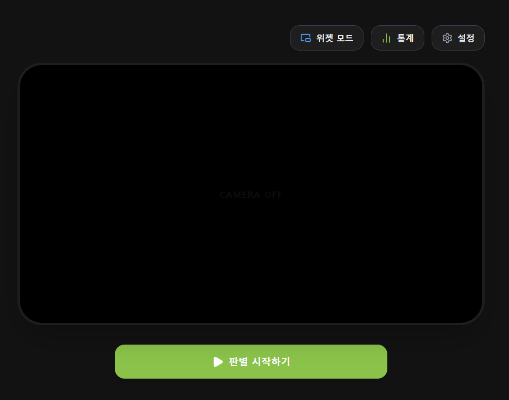 | 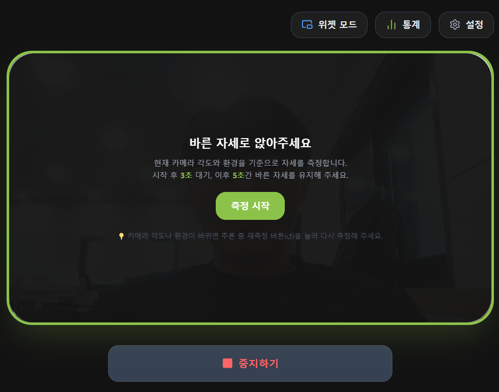 | 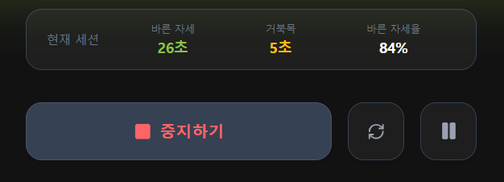 |

- **판별 시작하기** 버튼을 누르면 베이스라인 측정 단계로 진입
- 카메라 각도 변화에 따른 오차를 줄이기 위해 베이스라인을 측정하여 기준값으로 활용
- **새로고침** 버튼으로 베이스라인을 언제든지 재측정 가능
- 서비스 구동 중 사용 시간 동안 각 자세별 시간을 실시간으로 표시
- 거북목으로 판별되면 알림음과 함께 화면 UI가 변경

| 위젯 모드 |
|---------|
|  |

- 서비스 구동 중 소형 창으로 상태를 확인할 수 있는 **위젯 모드** 지원

</details>

<details>
<summary><b>주간 통계</b> — 자세 대시보드</summary>

최근 7일간의 날짜별 사용 시간과 자세별 비율 및 시간을 시각화해 확인할 수 있습니다.

| 주간 통계 | 일일 상세 |
|----------|---------|
| 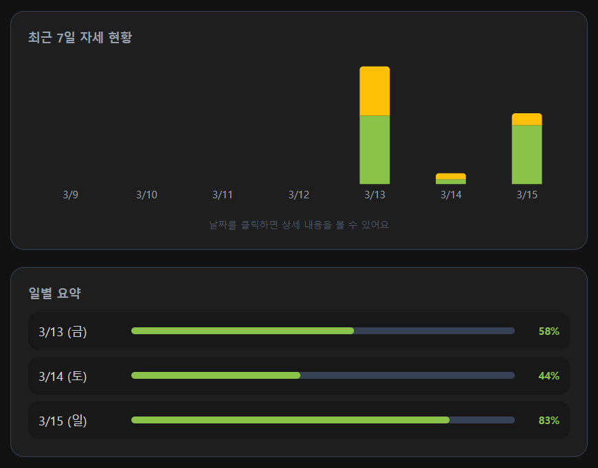 | 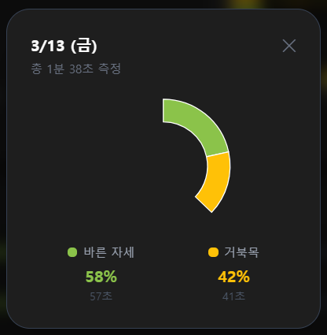 |

- 최근 7일간의 날짜별 사용 시간과 자세별 비율·시간을 막대 그래프로 표시
- 막대 그래프 클릭 시 원그래프 형태의 일일 상세 통계 확인 가능

</details>

<details>
<summary><b>설정</b> — 모델 관리 및 알림 설정</summary>

학습한 모델을 관리하고 알림 동작을 세부적으로 설정할 수 있습니다.

| 모델 설정 | 알림 설정 |
|---------|---------|
| 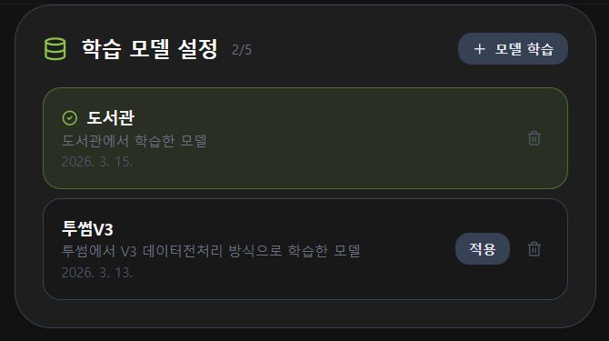 | 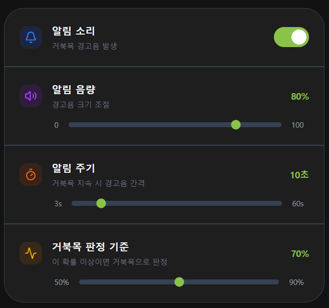 |

- 학습된 모델 목록 확인 및 **적용** 버튼으로 원하는 모델 전환 가능
- **모델 학습** 버튼으로 새 모델 추가 학습 가능 (최대 5개)
- 알림음 끄기, 음량 조절, 알림 주기 설정, 거북목 판별 기준 조정 지원

</details>

---

## 모델 학습 및 추론

<details>
<summary><b>데이터 추출 및 전처리</b></summary>

#### 랜드마크 추출

초기에는 MediaPipe **Pose**로 양쪽 귀·어깨 랜드마크의 x, y, z 좌표를 추출하였습니다.
그러나 Pose의 z값은 **골반을 기준**으로 측정되기 때문에, 어깨~얼굴만 화면에 담기는 일반적인 사용 환경에서 귀의 z값이 불안정했습니다.
특히 고개가 돌아간 경우 z값의 신뢰도가 낮아 모델 정확도에 악영향을 미쳤습니다.

이를 해결하기 위해 귀 랜드마크는 MediaPipe **Face Mesh**로 대체하여 추출하고, 어깨 랜드마크는 기존 Pose를 유지했습니다.

#### 특성(Feature) 설계

두 가지 특성 값을 사용합니다. 두 특성 모두 **어깨 너비로 나눠 정규화**하여 카메라 거리 변화의 영향을 제거합니다.

| 특성 | 계산식 | 의미 |
|------|--------|------|
| f1 (귀 거리 비율) | `3D 양쪽 귀 거리 / 2D 어깨 너비` | 거북목 시 얼굴이 화면에 가까워질수록 귀 사이 거리가 증가하는 점 활용 |
| f2 (귀-어깨 수직 거리 비율) | `(어깨 중점 y - 귀 중점 y) / 2D 어깨 너비` | 거북목 시 어깨와 귀 사이의 수직 거리가 감소하는 점 활용 |

#### 베이스라인 차분으로 카메라 각도 문제 해결

위 두 특성만 사용했을 때 카메라 각도 변화에 따른 오차로 모델 정확도가 **0.7434**에 그쳤습니다.

정상 자세 측정 시 수집한 각 특성의 평균값을 **베이스라인**으로 저장하고,
실시간 추론 시 raw 특성 대신 `현재값 - 베이스라인` 차이를 특성으로 사용하도록 변경했습니다.
카메라 각도가 달라져도 정상 자세 대비 상대적 변화량만 측정하므로 각도 영향이 줄어들어 정확도가 **0.9735**로 향상되었습니다.

</details>

<details>
<summary><b>모델 선택 및 이유</b></summary>

특성이 2개인 단순한 이진 분류 문제로, 복잡한 모델보다 **선형 분류기**가 적합하다고 판단했습니다.
추론이 실시간으로 반복 실행되므로 경량 모델이어야 했고, 저차원 데이터에서 빠르고 안정적으로 동작하는 **SVM**과 **Logistic Regression**을 후보로 실험하였습니다.

실험 결과 두 모델 간 정확도 차이가 미미했고, 단순 분류 결과 외에 **거북목일 확률 값**을 활용하고자 확률 출력을 기본으로 지원하는 **Logistic Regression**을 최종 선택했습니다.

</details>

<details>
<summary><b>학습 파이프라인</b></summary>

```
[클라이언트]
  MediaPipe로 각 자세별 랜드마크 좌표 추출
  → 필요한 랜드마크만 필터링 (양쪽 귀·어깨)
  → 자세 라벨 부여 (0: 정상, 1: 거북목)
  → Spring Boot 서버에 학습 요청 (좌표 데이터 + 모델 이름/설명)

[Spring Boot]
  → 학습 데이터 S3 업로드
  → Lambda 동기 호출 (s3Key, memberId, 모델 이름/설명 전달)
  → Lambda 완료 대기 후 클라이언트에 완료 응답

[Lambda]
  → S3에서 학습 데이터 수신
  → 정상 자세 샘플로 베이스라인 계산
  → 전체 샘플 특성 추출 (베이스라인 차분 적용)
  → StandardScaler로 특성 스케일링
  → Logistic Regression 학습
  → 모델 번들 (model + scaler) S3 저장
  → kkobuk_ai DB에 학습 데이터·모델 메타데이터 저장
     (기존 모델 INACTIVE → 신규 모델 ACTIVE 자동 전환)
```

**설계 결정 사항**

- **클라이언트 사이드 좌표 추출** — 영상 데이터 대신 좌표값만 전송하여 네트워크 오버헤드를 최소화
- **Spring Boot 경유 Lambda 호출** — 클라이언트가 Lambda를 직접 호출하지 않고 서버를 거쳐 AWS 자격증명 노출 방지
- **학습 데이터 S3 경유 전달** — Lambda 요청 페이로드 크기 제한을 고려해 학습 데이터는 S3에 업로드 후 S3 키만 페이로드로 전달 (비동기 호출 시 페이로드 제한이 더 작아지므로 이 구조가 유리)
- **동기 호출** — LR 모델 학습 특성상 수초 내에 완료되므로 현재는 동기 호출로 처리, 추후 필요 시 비동기 호출로 개선 예정
- **모델 번들 저장** — 추론 시 일관성을 위해 model · scaler를 하나의 번들로 묶어 S3에 저장

</details>

<details>
<summary><b>추론 파이프라인</b></summary>

```
[클라이언트] 판별 시작하기 버튼 클릭
  → FastAPI 서버에 WebSocket 연결 (JWT 토큰을 쿼리 파라미터로 전달)

[FastAPI]
  → JWT 검증 후 member_id 추출
  → kkobuk_ai DB에서 사용자 ACTIVE 모델 조회
  → 메모리 캐시 미스 시 S3에서 모델 로드 후 캐싱
  → 클라이언트에 connected 응답

[클라이언트] 베이스라인 측정
  → 정상 자세로 일정 시간 동안 MediaPipe로 좌표값 수집
  → baseline 타입 WSS 요청으로 좌표 샘플 전송

[FastAPI]
  → 베이스라인 계산 후 WebSocket 세션에 저장
  → 클라이언트에 ready 응답

[클라이언트] 추론 루프
  → 일정 주기마다 MediaPipe로 좌표값 추출
  → frame 타입 WSS 요청으로 랜드마크 전송

[FastAPI]
  → 세션에 저장된 베이스라인으로 특성 추출 → 스케일링 → LR 모델 추론
  → 결과(label: good/bad, confidence) 응답

[클라이언트]
  → 결과에 따라 UI 반영 (거북목 감지 시 알림음 + 화면 변경)
```

**설계 결정 사항**

- **JWT 쿼리 파라미터 전달** — WebSocket은 브라우저 환경에서 커스텀 헤더를 지원하지 않으므로 JWT를 쿼리 파라미터로 전달
- **S3 로드 시 thread executor 사용** — S3 다운로드는 blocking I/O이므로 async 함수 내에서 직접 실행하면 단일 이벤트 루프가 멈춰 다른 모든 클라이언트의 요청 처리가 중단됨. `run_in_executor`로 스레드풀에 위임하여 S3 로드 중에도 이벤트 루프가 다른 연결들을 계속 처리할 수 있도록 함
- **model_id 기반 LRU 캐시** — 모델을 메모리에 캐싱하여 반복적인 S3 다운로드 제거, 다중 인스턴스 환경에서도 캐시 키가 model_id 기준이라 인스턴스 간 동기화 불필요
- **베이스라인 WebSocket 세션 저장** — 베이스라인은 모델 번들에 포함하지 않고 연결 시 재측정하여 세션 로컬 변수로 유지, 동일 모델을 다른 카메라 각도에서 사용해도 정확도 보장
- **confidence 반환** — 분류 결과(label)와 함께 확률값(confidence)을 반환하여 클라이언트가 판별 기준 임계값을 유연하게 조정 가능

</details>

---

## 기술 스택

| 영역 | 기술 |
|------|------|
| 클라이언트 | Electron 39, React 19, Vite, Tailwind CSS, MediaPipe |
| API 서버 | Spring Boot 4.0.2, Java 25, Redis 7, Nginx (블루그린 배포) |
| AI 추론 서버 | FastAPI, scikit-learn (Logistic Regression), Nginx (블루그린 배포) |
| 학습 파이프라인 | AWS Lambda (Python), scikit-learn, NumPy |
| 데이터 저장소 | MySQL 8 (RDS — kkobuk / kkobuk_ai), Redis 7, AWS S3 |
| 인프라 | AWS EC2, RDS, S3, Lambda / Nginx 로드밸런서 / Terraform |
| CI/CD | GitHub Actions |
